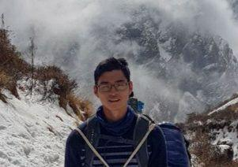
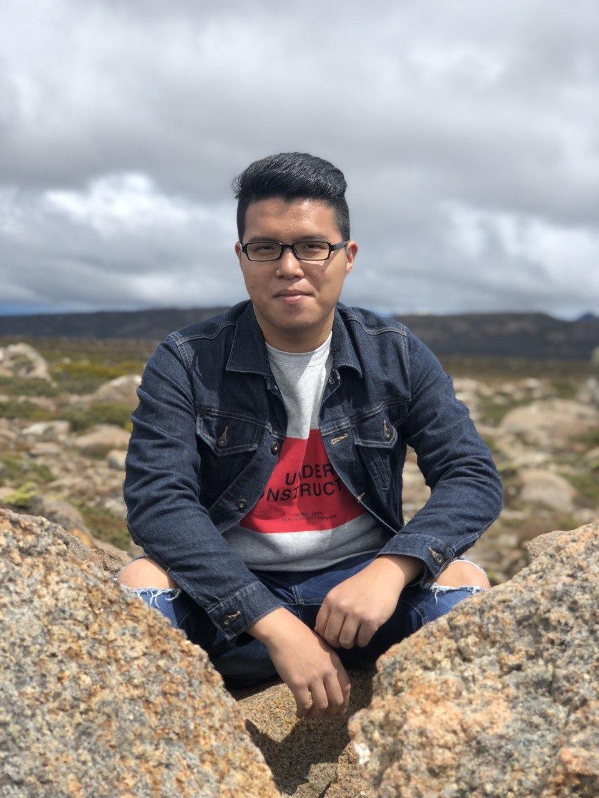

We are a team based in the [School of Computing, National University of Singapore](http://www.comp.nus.edu.sg).

You can reach us at the email `seer[at]comp.nus.edu.sg`

## Project team

### John Doe

[[homepage](http://www.comp.nus.edu.sg/~damithch)]
[[github](https://github.com/johndoe)]
[[portfolio](team/johndoe.md)]

* Role: Project Advisor

### Jane Doe

[[github](http://github.com/johndoe)]
[[portfolio](team/johndoe.md)]

* Role: Team Lead
* Responsibilities: UI

### Khor Jing Qian

[[github](http://github.com/khor-jingqian)] [[portfolio](team/khor-jingqian.md)]

* Role: Developer
* Responsibilities: Deliverables and deadlines

### Wu Licheng

[[github](https://github.com/Licheng-Wu)]
[[portfolio](team/wu-licheng.md)]

* Role: Developer
* Responsibilities: Testing

### Nicholas Yeo

[[github](http://github.com/nicholasyeo)]
[[portfolio](team/nicholasyeo.md)]

* Role: Developer
* Responsibilities: Code Quality
