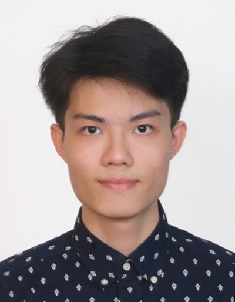
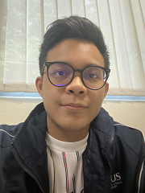

We are a team based in the [School of Computing, National University of Singapore](http://www.comp.nus.edu.sg).

You can reach us at the email `e0406741[at]u.nus.edu`

## Project team

### Tan Xi Zhe

[[github](http://github.com/patricktan6)]
[[portfolio](team/patricktan6.md)]

* Role: Developer
* Responsibilities: UI

### Khor Jing Qian

[[github](http://github.com/khor-jingqian)] [[portfolio](team/khor-jingqian.md)]

* Role: Developer
* Responsibilities: Deliverables and deadlines

### Wu Licheng

[[github](https://github.com/Licheng-Wu)]
[[portfolio](team/wu-licheng.md)]

* Role: Developer
* Responsibilities: Testing

### Iqbal Imran

[[github](http://github.com/iqbxl)]
[[portfolio](team/iqbxl.md)]

* Role: Developer
* Responsibilities: Documentation

### Nicholas Yeo

[[github](http://github.com/nicholasyeo)]
[[portfolio](team/nicholasyeo.md)]

* Role: Developer
* Responsibilities: Code Quality
