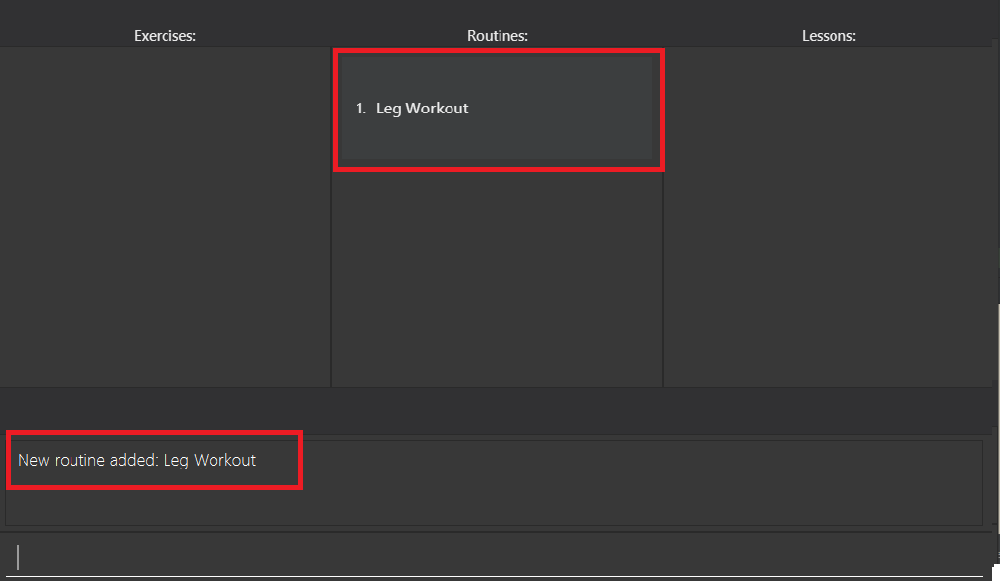
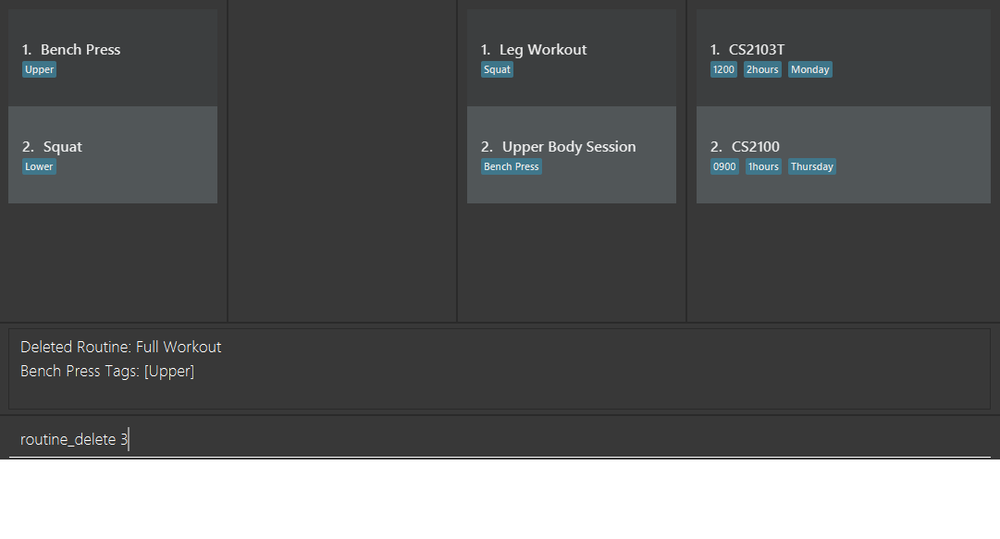
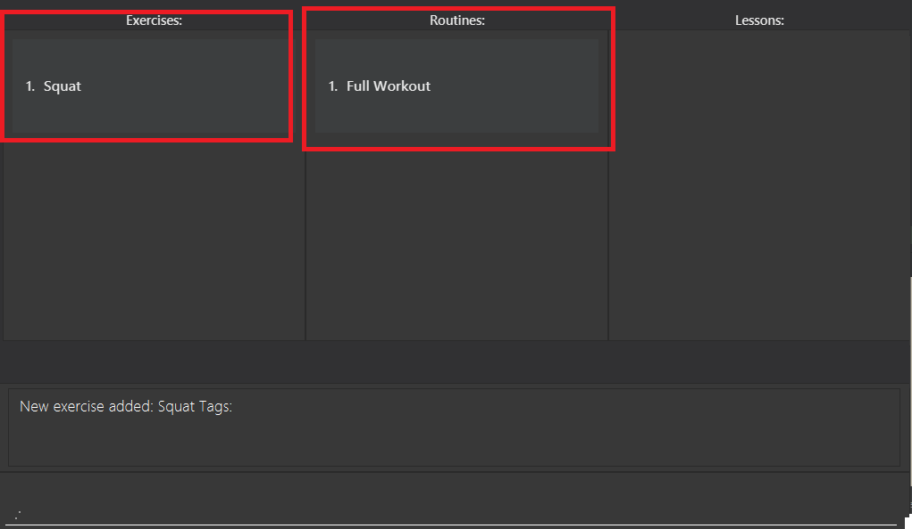
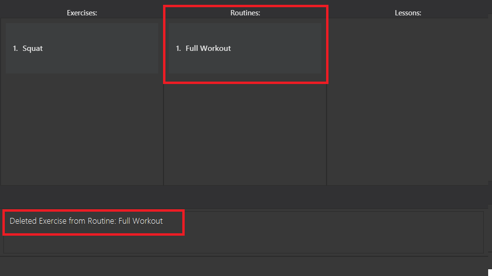
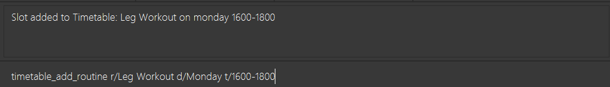
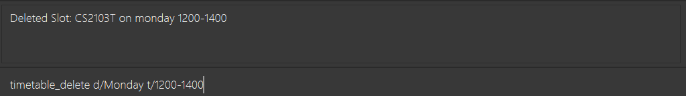

##Introduction

fitNUS is tailored for **NUS students** that are interested in staying healthy and keeping fit. It is suitable for **all
fitness levels** and is equipped with a **customisable timetable** for you to manage your time wisely and slot in your
workout routines with ease.
   
fitNUS is  **optimized for use via a Command Line Interface** (CLI) while still having the benefits of a Graphical User Interface (GUI). If you can type fast, fitNUS can get your scheduling tasks done faster than traditional GUI apps.

   

--------------------------------------------------------------------------------------------------------------------
## Quick start

1. Ensure you have Java `11` or above installed in your Computer.

1. Download the latest `fitNUS.jar` from [here](https://github.com/AY2021S1-CS2103T-T09-2/tp/releases).

1. Copy the file to the folder you want to use as the _home folder_ for your fitNUS.

1. Double-click the file to start the app. The GUI similar to the below should appear in a few seconds. Note how the app contains some sample data. 

1. Type the command in the command box and press Enter to execute it. Here are some sample commands you can try:
   
   * **`exercise_add`**`n/Curls t/Upper` : Creates an Exercise named "Curls" with a "Upper" tag.

   * **`routine_create`**`r/Upper Body Session` : Creates a routine names "Upper Body Session"

   * **`routine_add `**`r/Upper Body Session e/Curls` : Adds an exercise named "Curls" to a routine named "Upper Body Session"

   * **`timetable_add_routine`**`r/Upper Body Session d/Monday t/1600-1800` : Adds the routine "Upper Body Session" to your
   timetable on Monday at 1600HRS - 1800HRS.
   
1. Refer to the [Features](#features) below for details of each command.

--------------------------------------------------------------------------------------------------------------------
## Features 

### Miscellaneous

#### Help: `help`

Links you to the User Guide where there is comprehensive summary of all command in fitNUS. The link will appear in a
pop-up.

Format: `help`

#### Exit: `exit`

Save fitNUS data and closes the application.

Format: `exit`

### Exercise

### Routine
#### Create new routine : `routine create`

Creates a new routine by the given routine name.

Format: `routine_create r/ROUTINE_NAME`

Examples:
* `routine_create r/Leg Workout` Creates new routine with the name "Leg Workout".

#### Delete routine : `routine delete`

Deletes an existing routine corresponding to the given index.

Format: `routine delete INDEX`

Examples:
* `routine delete 3` Deletes routine with the index 3.

#### Add exercise to routine : `routine_add`

Add a new exercise to a specific routine.

Format: `routine_add r/NAME_OF_TARGET_ROUTINE e/EXERCISE_NAME`

Examples:
* `routine_add r/Leg Workout e/Squat` Adds an exercise named "Squat" to the routine "Leg Workout".

#### Delete exercise from routine : `routine_delete_exercise`

Add a new exercise to a specific routine.

Format: `routine_delete_exercise r/NAME_OF_TARGET_ROUTINE e/EXERCISE_NAME`

Examples:
* `routine_delete_exercise r/Full Workout e/Squat` Delete the exercise "Squat" from the routine "Full Workout".

#### View routine details : `routine view`

View the details of a certain routine.

Format: `routine view INDEX`

Examples:
* `routine view 2` Views routine with the index 2.

#### List routines : `routine list`

List out all the routines in fitNUS.

Format: `routine list`

### Timetable

#### View timetable : `timetable view`

View the user's timetable.

Format: `timetable view`

Examples:
* `timetable view` Views timetable.

#### Add routine to timetable : `timetable_add_routine`

Add a complete routine into the application's schedule.

Format: `timetable_add_routine r/ROUTINE_NAME d/DAY_OF_THE_WEEK t/TIMING`

Examples:
* `timetable_add_routine r/Leg Workout d/Monday t/1600-1800` Adds routine "Leg Workout" to schedule on Monday, 1600-1800.

#### Delete routine or lesson from schedule : `timetable_delete`

Delete a routine or lesson from the application's schedule.

Format: `timetable_delete d/DAY_OF_THE_WEEK t/TIMING`

Examples:
* `timetable_delete d/Monday t/1600-1800` Deletes the routine or lesson scheduled on Monday, 1600-1800.

###BMI
#### Add or edit height : `height`

Add height in centimetres.

Format: `height h/HEIGHT`

Examples:
* `height h/170` Adds or edits the height of the user, which is 170cm.

#### Add or edit weight : `weight`

Add weight in kilograms.

Format: `weight w/WEIGHT`

Examples:
* `weight w/70` Adds or edits the weight of the user, which is 70kg. 

#### View BMI : `bmi`

Calculate and view the user's BMI based on his/her height and weight.

Format: `bmi`

Examples:
* `bmi` Views BMI.

### Saving the data

fitNUS data are saved in the hard disk automatically after any command that changes the data. There is no need to save manually.

### Archiving data files `[coming in v2.0]`

_{explain the feature here}_

--------------------------------------------------------------------------------------------------------------------

## FAQ

**Q**: How do I transfer my data to another Computer? 
**A**: Install the app in the other computer and overwrite the empty data file it creates with the file that contains the data of your previous fitNUS home folder.

--------------------------------------------------------------------------------------------------------------------

## Command summary

Action | Format, Examples
--------|------------------
**Link to User Guide** | `help`
**Create routine** | `routine_create r/ROUTINE_NAME​`   e.g., `routine_create r/Leg Day Session`
**Delete routine** | `routine delete INDEX`   e.g., `routine delete 10`
**Add exercise to routine** | `routine_add r/NAME_OF_TARGET_ROUTINE e/EXERCISE_NAME`  e.g., `routine_add r/Leg Day Session e/Squats`
**Delete exercise from routine** | `routine_delete_exercise r/NAME_OF_TARGET_ROUTINE e/EXERCISE_NAME​`  e.g.,`routine_delete_exercise r/Leg Day Session e/Squats`
**View routine details** | `routine view INDEX`  e.g., `routine view 2`
**List routines** | `routine list`
**Add routine to schedule** | `timetable_add_routine r/ROUTINE_NAME d/DAY_OF_THE_WEEK t/TIMING`   e.g., `timetable_add_routine add r/Leg Day Session d/Monday t/1600-1800`
**Delete routine from schedule** | `timetable_delete d/DAY_OF_THE_WEEK t/TIMING`   e.g., `timetable_delete d/Monday t/1600-1800`
**View timetable** | `timetable view`

