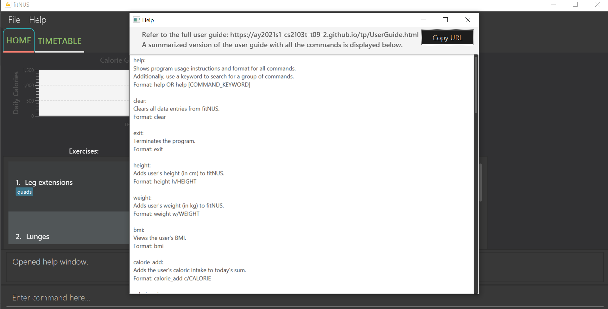

By: `Team T09-2` Since: `September 2020`

**Table of Contents:**

* Table of Contents
{:toc}

------------------------------------------------------------------------------------------------------------------------
## 1. Introduction

fitNUS is tailored for **NUS students** that are interested in staying healthy and keeping fit. It is suitable for **all
fitness levels** and is equipped with a customisable **Timetable** for you to manage your time wisely and slot in your
workout routines with ease. fitNUS also displays a **Calorie Graph** to track your daily caloric intake and expenditure.
The application is extremely easy to use, all you have to do is type in your commands in the command box, and the
information will be reflected in the user interface for ease of viewing.

This User Guide aims to showcase the features that fitNUS provides, as well as **step-by-step instructions**
regarding how to make use of these features.

--------------------------------------------------------------------------------------------------------------------
## 2. Additional Information

Please note the following formatting and notations that you will encounter as you read on about fitNUS features:

Formatting | Meaning | Examples
--------|-------|-----------
e/EXAMPLE | The character before the forward slash ("/") is a prefix, and words in **UPPER_CASE** after the slash are the parameters to be supplied by you | In `exercise_add e/EXERCISE`, `EXERCISE` is a parameter which can be used as `exercise_add e/Deadlift`
[ x/X ] | Square brackets signify optional fields that you can consider using | `exercise_add e/EXERCISE [t/TAG]` can be used as `exercise_add e/Deadlift t/glutes` or `exercise_add e/Deadlift`
`...` | Fields which are followed by `...` indicate that they can be used more than once | `[t/TAG]...` can be used as `t/first t/important t/form` etc.
Duplicate parameters | Only the argument of the last occurring duplicate parameter will be considered if the command format does not expect multiple parameters (i.e. fields without `...`) | In `exercise_add e/Deadlift e/Lunges`, an exercise with the name `Lunges` will be added and `e/Deadlift` is ignored
Order of parameters | Valid parameters can be provided in any order unless one of the parameters is `INDEX`, in which case `INDEX` must be the first parameter | In `exercise_edit INDEX [e/EXERCISE] [t/TAG]...`, `exercise_edit INDEX [t/TAG]... [e/EXERCISE]` is also accepted. However, `exercise_edit [e/EXERCISE] INDEX [t/TAG]...` is not allowed
`mark-up` | Grey highlight of a word signifies the actual input that you can use | You can type `exercise_delete 1` in the command box and press *Enter* to execute the command
Call Outs | Red boxes will be drawn up around areas of interest to alert you `[coming in v1.4]` | -

Check out the list below to get started on using this User Guide.

* If this is your first time using fitNUS, refer to the [Quick Start](#3-quick-start) for step-by-step instructions on how
to download and set up fitNUS on your Computer.

* If you want to explore the different features of fitNUS, go to the [Commands](#4-commands) section.

* If you are familiar with fitNUS or want to do a quick lookup of all the available commands, go to the
[Command Summary](#5-command-summary) section.

--------------------------------------------------------------------------------------------------------------------
## 3. Quick Start

1. Ensure you have Java `11` or above installed in your Computer.

1. Download the latest `fitNUS.jar` from [here](https://github.com/AY2021S1-CS2103T-T09-2/tp/releases).

1. Copy the file to the folder you want to use as the _home folder_ for your fitNUS.

1. Double-click the file to start the app. The GUI similar to the one [above](#1-introduction) should appear in a few seconds.
Note how the app contains some sample data. 

1. Type your desired command in the command box and press *Enter* to execute it. To verify that fitNUS is working for you,
here are some sample commands you can try:

   * **`exercise_add`**`e/Curls t/Upper` : Creates an Exercise named "Curls" with an "Upper" tag.

   * **`routine_create`**`r/Upper Body Session` : Creates a Routine named "Upper Body Session".

   * **`routine_add_exercise `**`r/Upper Body Session e/Curls` : Adds an Exercise named "Curls"
   to a Routine named "Upper Body Session".

   * **`timetable_add_routine`**`r/Upper Body Session D/Monday T/1600-1800` : Adds the Routine "Upper Body Session"
   to your timetable on Monday at 1600HRS - 1800HRS.

1. Now that fitNUS is running as expected, you can kick-start your fitness journey and achieve your goals!
Experience first-hand the convenience that fitNUS brings to your life by exploring the various commands yourself.

   * Learn more about the specific details of each command [here](#4-commands).

   * A complete summary of all commands is available [here](#5-command-summary) in table format.

--------------------------------------------------------------------------------------------------------------------
## 4. Commands

In this section, each command will be explained in greater depth. Illustrations are used to allow visual aid.
The purpose of each command, how it is formatted and usage examples are found in the subsequent subsections.

### 4.1 Exercise

An Exercise is the foundation of fitNUS. It represents a certain exercise that you can perform and you can glean more
information about it from the tags under it.

#### 4.1.1 Create new exercise : `exercise_add`

Creates a new exercise in fitNUS with the given exercise name.

Format: `exercise_add e/EXERCISE [t/TAG]...`

Example:
* `exercise_add e/Pull Ups t/Body` Creates a new exercise with the name "Pull Ups" and tag "Body".

**Before adding an exercise:**

Note that there is currently one exercise stored.

**Successful outcome of adding an exercise "Pull Ups":**

#### 4.1.2 Delete exercise : `exercise_delete`

Deletes an existing exercise in fitNUS corresponding to the given index.

Format: `exercise_delete INDEX`

Example:
* `exercise_delete 1` Deletes the exercise at index 1 in the list.

**Before deleting the first exercise:**

**After deleting the first exercise:**

Note that the first exercise is now "Pull Ups" and no longer "Bench Press".

#### 4.1.3 Edit exercise : `exercise_edit`

Edits the details of the exercise identified by the index number used in the displayed exercise list.
Existing values will be overwritten by the input values.

Format: `exercise_edit INDEX [e/EXERCISE] [t/TAG]...`

Example:
* `exercise_edit 3 e/Squats t/Lower` Edits the exercise at index 3 in the list to the name "Squats" and tag "Lower".

**Before editing the third exercise:**

**Successful outcome of editing the third exercise to "Squats":**

Note that the third exercise is now "Squats" and no longer "Lunges".

#### 4.1.4 Find exercise : `exercise_find`

Finds all exercises in fitNUS whose names contain all of the specified keywords.

Format: `exercise_find KEYWORD [MORE_KEYWORDS]...`

Example:
* `exercise_find bench` Lists all exercises with names containing "bench" keyword.

**Before finding exercises with "bench" keyword:**

Note that fitNUS currently displays 3 exercises.

**After finding exercises with "bench" keyword:**

Note that fitNUS now lists only 1 exercise and displays a success message for you.

#### 4.1.5 List exercise : `exercise_list`

After finding a certain exercise, you may want to view all the exercises registered in fitNUS again.
This command lists all existing exercises in fitNUS for you to view.

Format: `exercise_list`

Example:
* `exercise_list` Displays a list of all exercises in fitNUS.

**Before listing all exercises:**

Note that you are viewing only 1 exercise as of now.

**After listing all exercises:**

### 4.2 Routine

Routine is the next building block in fitNUS. It is a collection of Exercise items, and you can customise a
Routine however you want to, by adding or deleting Exercises from it. You will be able to add Routines to your
Timetable, but we will cover more of this later.

#### 4.2.1 Create new routine : `routine_create`

Creates a new routine in fitNUS with the given routine name.

Format: `routine_create r/ROUTINE`

Example:
* `routine_create r/Leg Workout` Creates a new routine with the name "Leg Workout".

**Before adding a routine:**

Note that there are no routines stored currently.

**Successful outcome of creating a routine "Leg Workout":**

#### 4.2.2 Delete routine : `routine_delete`

Deletes an existing routine in fitNUS corresponding to the given index.

Format: `routine_delete INDEX`

Example:
* `routine_delete 3` Deletes the routine with index 3 in the list.

**Before deleting the third routine:**

Note that fitNUS currently displays 3 routines.

**After deleting the third routine:**

Note that fitNUS now displays only 2 routines, and the third routine "Full Body Workout" is now removed.

#### 4.2.3 Find routine : `routine_find`

Finds all routines in fitNUS whose names contain all of the specified keywords.

Format: `routine_find KEYWORD [MORE_KEYWORDS]...`

Example:
* `routine_find upper body` Lists all routines with names containing "upper" and "body" keywords.

**Before finding routines with "upper" and "body" keywords:**

Note that fitNUS currently displays 2 routines.

**After finding routines with "upper" and "body" keywords:**

Note that fitNUS now lists only 1 routine and displays a success message for you.

#### 4.2.4 List routine : `routine_list`

After finding a certain routine, you may want to view all the routines registered in fitNUS again.
This command lists all existing routines in fitNUS for you to view.

Format: `routine_list`

Example:
* `routine_list` Displays a list of all routines in fitNUS.

**Before listing all routines:**

Note that you are viewing only 1 routine as of now.

**After listing all routines:**

#### 4.2.5 Add exercise to routine : `routine_add_exercise`

Adds an existing exercise to a specific routine in fitNUS.

Format: `routine_add_exercise r/ROUTINE e/EXERCISE`

Example:
* `routine_add_exercise r/Leg Workout e/Squats` Adds an exercise named "Squats" to the routine "Leg Workout".

**Before adding "Squats" to "Leg Workout":**

Note that "Squats" and "Leg Workout" already exist in fitNUS.

**After adding "Squats" to "Leg Workout"**

Note that "Squats" now belongs to "Leg Workout" as a tagging, and fitNUS displays a success message.

#### 4.2.6 Delete exercise from routine : `routine_delete_exercise`

Removes an exercise from a specific routine in fitNUS.

Format: `routine_delete_exercise r/ROUTINE e/EXERCISE`

Example:
* `routine_delete_exercise r/Leg Workout e/Squats` Deletes the exercise "Squats" from the routine "Leg Workout".

**Before removing "Squats" from "Leg Workout":**

Note that "Squats" and "Leg Workout" already exist in fitNUS.

**After removing "Squats" from "Leg Workout"**

Note how "Squats" is no longer found under "Leg Workout" as a tagging, and fitNUS displays a success message.

#### 4.2.7 View routine details : `routine_view`

Views the a certain routine in fitNUS indicated by the index.

Format: `routine_view INDEX`

Example:
* `routine_view 2` Views the routine at index 2 in the list.

**Before viewing the second routine:**

Note that fitNUS currently displays 2 routines.

**After viewing the second routine:**

Note how you can only see the routine that was at the second index which is "Leg Workout".

### 4.3 Lesson

fitNUS also boasts a customisable timetable for you to use. You can add Lessons to your Timetable to better keep track
of your time and never forget another training session.

#### 4.3.1 Create new lesson : `lesson_add`

Creates a new lesson in fitNUS with the given lesson name.

Format: `lesson_add n/LESSON [t/TAG]...`

Example:
* `lesson_add n/CS2100 t/priority t/homework` Creates a new lesson with the name "CS2100"
and tags "priority" and "homework".

**Before adding a lesson:**

Note that there is currently one lesson stored.

**Successful outcome of adding a lesson "CS2100":**

#### 4.3.2 Delete lesson : `lesson_delete`

Deletes an existing lesson in fitNUS corresponding to the given index.

Format: `lesson_delete INDEX`

Example:
* `lesson_delete 1` Deletes the lesson at index 1 in the list.

**Before deleting the first lesson:**

**After deleting the first lesson:**

Note that the first lesson is now "CS2100" and no longer "CS2103T".

#### 4.3.3 Edit lesson : `lesson_edit`

Edits the details of the lesson identified by the index number used in the displayed lesson list.
Existing values will be overwritten by the input values.

Format: `lesson_edit INDEX [n/LESSON] [t/TAG]...`

Example:
* `lesson_edit 3 n/CS2103T t/core` Edits the lesson at index 3 in the list to the name "CS2103T" and tag "core".

**Before editing the third lesson:**

**Successful outcome of editing the third lesson to "CS2103T":**

Note that the third lesson is now "CS2103T" and no longer "GER1000".

#### 4.3.4 Find lesson : `lesson_find`

Finds all lessons in fitNUS whose names contain any of the specified keywords.

Format: `lesson_find KEYWORD [MORE_KEYWORDS]...`

Example:
* `lesson_find CS GER` Lists all lessons with names containing "CS" or "GER" keywords.

**Before finding lessons with "CS" or "GER" keywords:**

Note that fitNUS currently displays 3 lessons.

**After finding lessons with "CS" or "GER" keywords:**

Note that fitNUS now lists 2 lessons and displays a success message for you.

#### 4.3.5 List lesson : `lesson_list`

After finding a certain lesson, you may want to view all the lessons registered in fitNUS again.
This command lists all existing lessons in fitNUS for you to view.

Format: `lesson_list`

Example:
* `lesson_list` Displays a list of all lessons in fitNUS.

**Before listing all lessons:**

Note that you are viewing 2 lessons as of now.

**After listing all lessons:**

### 4.4 Timetable

You can add both Routines and Lessons to your timetable to get an overview of your week. You can switch between the
Timetable and Homepage display by clicking on either of the tabs found at the top left of the interface.
In this subsection, we will explore the timetable feature and its respective commands.

Any changes made to existing routines or lessons that have already been added as a slot in the Timetable will be
reflected automatically on the Timetable.

#### 4.4.1 Add routine to timetable : `timetable_add_routine`

Adds a complete routine into the timetable in fitNUS.

Format: `timetable_add_routine r/ROUTINE D/DAY T/TIME`

Example:
* `timetable_add_routine r/Leg Workout D/Monday T/1600-1800`
Adds routine "Leg Workout" to timetable on Monday, 1600-1800.

**Before adding routine "Leg Workout" to Timetable:**

**After adding routine "Leg Workout" to Timetable:**

#### 4.4.2 Add lesson to timetable : `timetable_add_lesson`

Adds a lesson into the timetable in fitNUS.

Format: `timetable_add_lesson n/LESSON D/DAY T/TIME`

Example:
* `timetable_add_lesson n/CS2103T D/Wednesday T/1200-1400`
Adds lesson "CS2103T" to timetable on Wednesday, 1200-1400.

**Before adding lesson "CS2103T" to Timetable:**

Note that Leg Workout routine has already been added to the Timetable.

**After adding lesson "CS2103T" to Timetable:**

#### 4.4.3 Delete routine or lesson from schedule : `timetable_delete_slot`

Deletes a routine or lesson from the timetable in fitNUS.

Format: `timetable_delete_slot D/DAY T/TIME`

Example:
* `timetable_delete_slot D/Monday T/1600-1800`
Deletes the routine or lesson scheduled on Monday, 1600-1800.

**Before removing slot from Timetable:**

Note that Leg Workout routine and CS2103T lesson have already been added to the Timetable.

**After removing slot from Timetable:**

Note that Leg Workout routine slot is no longer reflected on the Timetable.

#### 4.4.4 View timetable :

Views the timetable in fitNUS.

Format: -

Example:
* Click on the timetable tab at the top left of the interface to view timetable.

**View of Timetable**

### 4.5 BMI

fitNUS allows you to record your height and weight in order to better keep track of the progression of your health
journey. You can check your current BMI once you have keyed in the 2 parameters in the command box.

#### 4.5.1 Add or edit height : `height`

Adds the specified height, in centimetres, to fitNUS.

Format: `height h/HEIGHT`

Examples:
* `height h/170.5` Adds or edits the height of the user, which is 170.5 cm.

#### 4.5.2 Add or edit weight : `weight`

Adds the specified weight, in kilograms, to fitNUS.

Format: `weight w/WEIGHT`

Examples:
* `weight w/72.8` Adds or edits the weight of the user, which is 72.8 kg.

#### 4.5.3 View BMI : `bmi`

Calculates and displays the user's BMI based on the height and weight input.

Format: `bmi`

Examples:
* `bmi` Views BMI.

### 4.6 Calorie

You can keep track of your daily caloric intake and expenditure by inputting the values in the command box.
You can add or deduct a specified amount from your current calorie count. All successful modifications will be
automatically reflected in the Calorie Graph.

#### 4.6.1 Add calories : `calorie_add`

Adds the specified calorie amount to fitNUS.

Format: `calorie_add c/CALORIE`

Examples:
* `calorie_add c/600` Adds 600 calories to today's sum.

#### 4.6.2 Deduct calories : `calorie_minus`

Deducts the specified calorie amount from today's sum.

Format: `calorie_minus c/CALORIE`

Examples:
* `calorie_minus c/250` Deducts 250 calories from today's sum.

### 4.7 Miscellaneous

These are some essential commands that you can use fitNUS that are not linked to any of our features.

#### 4.7.1 Help: `help`

Links you to the User Guide where there is comprehensive summary of all commands in fitNUS. The link will appear in a
pop-up. Additionally, use a keyword to search for a group of commands.

Format: `help` or `help [COMMAND_KEYWORD]`

#### 4.7.2 Clear: `clear`

Clears all data entries from fitNUS.

Format: `clear`

Example:
* `clear` Clear all data entries from fitNUS.

**Before clearing data:**

Note that fitNUS currently displays some exercises, routines and lessons.

**After clearing data:**

Note that fitNUS now displays an interface with no data entries.

#### 4.7.3 Exit: `exit`

Saves fitNUS data and terminates the application.

Format: `exit`

### 4.8 Saving the data

Data in fitNUS is saved in the hard disk automatically after any command that changes the data.
There is no need to save manually.

### 4.9 Archiving data files `[coming in v2.0]`

_{explain the feature here}_

--------------------------------------------------------------------------------------------------------------------

## 5. Command Summary

### 5.1 Exercise

Action | Format | Examples
--------|-------|-----------
**Create Exercise** | `exercise_add e/EXERCISE [t/TAG]...` | `exercise_add e/Bench Press t/Upper`
**Delete Exercise** | `exercise_delete INDEX` | `exercise_delete 1`
**Edit Exercise** | `exercise_edit INDEX [e/EXERCISE] [t/TAG]...` | `exercise_edit 3 e/Squats t/Lower`
**Find Exercise** | `exercise_find KEYWORD [MORE_KEYWORDS]...` | `exercise_find Bench`
**List Exercise** | `exercise_list` | `exercise_list`

### 5.2 Routine

Action | Format | Examples
--------|-------|-----------
**Create Routine** | `routine_create r/ROUTINE` | `routine_create r/Leg Day Session`
**Delete Routine** | `routine_delete INDEX` | `routine delete 5`
**Find Routine** | `routine_find KEYWORD [MORE_KEYWORDS]...` | `routine_find upper body`
**List Routine** | `routine list` | `routine_list`
**Add Exercise to Routine** | `routine_add_exercise r/ROUTINE e/EXERCISE` | `routine_add_exercise r/Leg Day Session e/Squats`
**Delete Exercise from Routine** | `routine_delete_exercise r/ROUTINE e/EXERCISE` | `routine_delete_exercise r/Leg Day Session e/Squats`
**View Routine details** | `routine_view INDEX` | `routine_view 2`

### 5.3 Lesson

Action | Format | Examples
--------|-------|-----------
**Create Lesson** | `lesson_add n/LESSON [t/TAG]...` | `lesson_add n/CS2100 t/priority t/homework`
**Delete Lesson** | `lesson_delete INDEX` | `lesson_delete 1`
**Edit Lesson** | `lesson_edit INDEX [n/LESSON] [t/TAG]...` | `lesson_edit 3 n/CS2103T t/core`
**Find Lesson** | `lesson_find KEYWORD [MORE_KEYWORDS]...` | `lesson_find CS GER`
**List Lesson** | `lesson_list` | `lesson_list`

### 5.4 Timetable

Action | Format | Examples
--------|-------|-----------
**Add Routine to Timetable** | `timetable_add_routine r/ROUTINE D/DAY T/TIME` | `timetable_add_routine r/Leg Day Session D/Monday T/1600-1800`
**Add Lesson to Timetable** | `timetable_add_lesson n/LESSON D/DAY T/TIME` | `timetable_add_lesson n/CS2103T D/Tuesday T/1200-1400`
**Delete Routine or Lesson from Timetable** | `timetable_delete_slot D/DAY T/TIME` | `timetable_delete_slot D/Monday T/1600-1800`
**View timetable** | - | Click on timetable tab at the top left of interface

### 5.5 BMI

Action | Format | Examples
--------|-------|-----------
**Add or edit Height** | `height h/HEIGHT` | `height h/170.5`
**Add or edit Weight** | `weight w/WEIGHT` | `weight w/72.8`
**View BMI** | `bmi` | `bmi`

### 5.6 Calorie

Action | Format | Examples
--------|-------|-----------
**Add Calories** | `calorie_add c/CALORIE` | `calorie_add c/1000`
**Deduct Calories** | `calorie_minus c/CALORIE` | `calorie_minus c/200`

### 5.7 Miscellaneous

Action | Format | Examples
--------|-------|-----------
**Link to User Guide** | `help` | `help`
**Clear all data entries from fitNUS** | `clear` | `clear`
**Save and exit fitNUS** | `exit` | `exit`

--------------------------------------------------------------------------------------------------------------------

## 6. FAQ

**Q**: How do I transfer my data to another Computer? 
**A**: Install the app in the other computer and overwrite the empty data file it creates with the file that contains the data of your previous fitNUS home folder.
