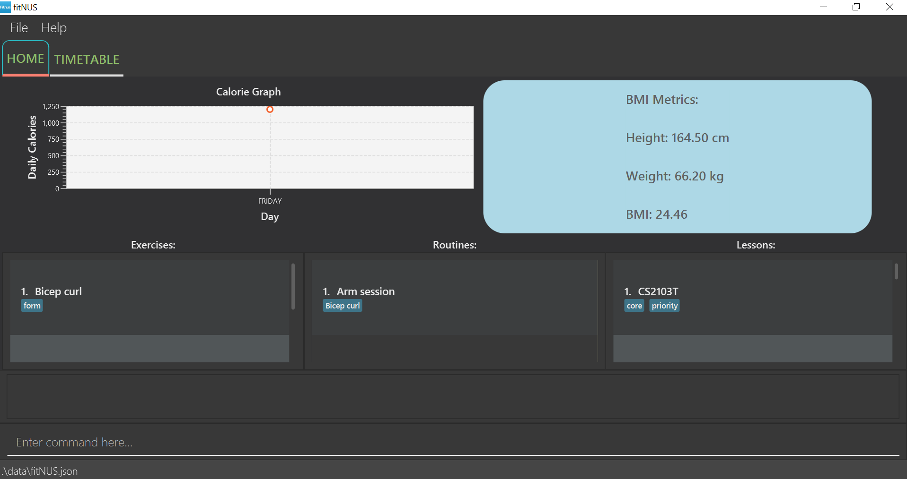
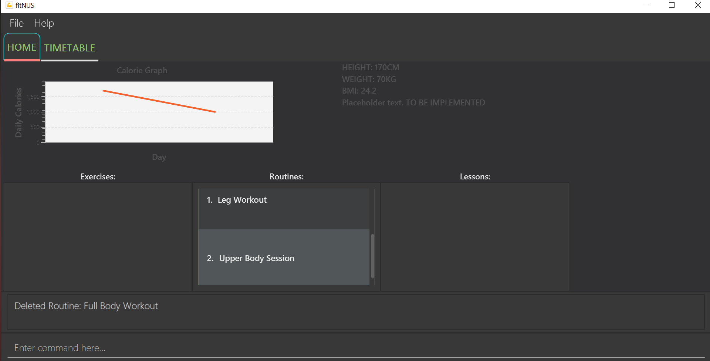
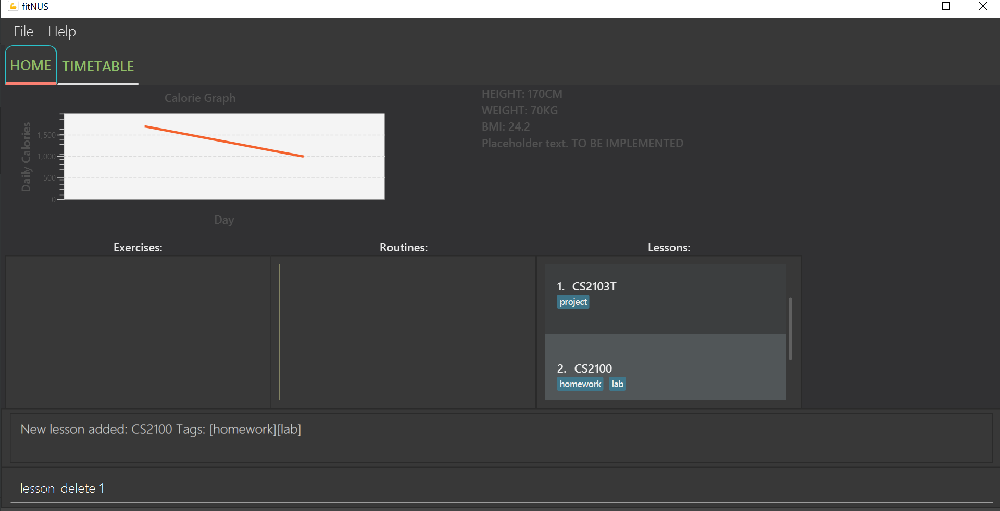
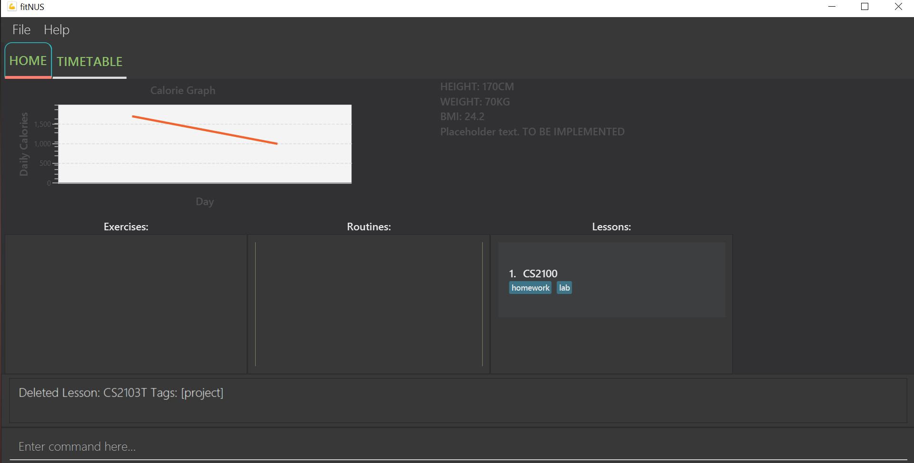

* Table of Contents
{:toc}

------------------------------------------------------------------------------------------------------------------------
## 1. Introduction

fitNUS is tailored for **NUS students** that are interested in staying healthy and keeping fit. It is suitable for **all
fitness levels** and is equipped with a **customisable timetable** for you to manage your time wisely and slot in your
workout routines with ease.
fitNUS is extremely easy to use, all you have to do is type in your commands in the command box, and the information
will be reflected in the user interface for ease of viewing.

This User Guide aims to showcase the features that fitNUS provides, as well as **step-by-step instructions**
regarding how to make use of these features.

--------------------------------------------------------------------------------------------------------------------
## 2. Quick start

1. Ensure you have Java `11` or above installed in your Computer.

1. Download the latest `fitNUS.jar` from [here](https://github.com/AY2021S1-CS2103T-T09-2/tp/releases).

1. Copy the file to the folder you want to use as the _home folder_ for your fitNUS.

1. Double-click the file to start the app. The GUI similar to the above should appear in a few seconds.
Note how the app contains some sample data. 

1. Type the command in the command box and press Enter to execute it. Here are some sample commands you can try:

   * **`exercise_add`**`n/Curls t/Upper` : Creates an Exercise named "Curls" with an "Upper" tag.

   * **`routine_create`**`r/Upper Body Session` : Creates a Routine named "Upper Body Session".

   * **`routine_add_exercise `**`r/Upper Body Session e/Curls` : Adds an Exercise named "Curls"
   to a Routine named "Upper Body Session".

   * **`timetable_add_routine`**`r/Upper Body Session d/Monday T/1600-1800` : Adds the Routine "Upper Body Session"
   to your timetable on Monday at 1600HRS - 1800HRS.

1. Refer to the [Features](#features) below for details of each command.

--------------------------------------------------------------------------------------------------------------------
## 3. Commands

Please note the following formatting and notations that you will encounter as you read on about fitNUS features:

Formatting | Meaning | Examples
--------|-------|-----------
e/EXAMPLE | The character before the slash is a prefix, and the capital letters that comes after the slash is your input | n/Leg Workout
[ x/X ] | Square brackets signify optional fields that you can consider using| [t/Compound]
`mark-up` | Grey highlight of a word signifies the actual input that you can use | `exercise_delete 1`
Call Outs | Red boxes will be drawn up around areas of interest to alert you | -

### 3.1 Exercise

An Exercise is the foundation of fitNUS. It represents a certain exercise that you can perform and you can glean more
information about it from the tags under it.

#### 3.1.1 Create new exercise : `exercise_add`

Creates a new exercise in fitNUS with the given exercise name.

Format: `exercise_add e/EXERCISE [t/TAG]`

Example:
* `exercise_add n/Bench Press t/Upper` Creates a new exercise with the name "Bench Press"
and tag "Upper".

**Successful outcome of adding an exercise "Bench Press":**

#### 3.1.2 Delete exercise : `exercise_delete`

Deletes an existing exercise in fitNUS corresponding to the given index.

Format: `exercise_delete INDEX`

Example:
* `exercise_delete 1` Deletes the exercise at index 1 in the list.

**Before deleting the first exercise:**

**After deleting the first exercise:**

Note that the first exercise is now "Pull Ups" and no longer "Bench Press".

#### 3.1.3 Edit exercise : `exercise_edit`

Edits the details of the exercise identified by the index number used in the displayed exercise list.
Existing values will be overwritten by the input values.

Format: `exercise_edit INDEX [e/EXERCISE] [t/TAG]`

Example:
* `exercise_edit 3 e/Squats t/lower` Edits the exercise at index 3 in the list with the name "Squats"
and tag "lower".

#### 3.1.4 Find exercise : `exercise_find`

Finds all exercises in fitNUS whose names contain any of the specified keywords.

Format: `exercise_find KEYWORD [MORE_KEYWORDS]`

Example:
* `exercise_find bench` Lists all exercises with names matching "bench".

**Before finding exercises with "bench":**

Note that fitNUS currently displays 3 exercises.

**After finding exercises with "bench":**

Note that fitNUS now lists only 1 exercise and displays a success message for you.

#### 3.1.5 List exercise : `exercise_list`

Lists all existing exercises in fitNUS for you to view.

Format: `exercise_list`

**Before listing all exercises:**

Note that you are viewing only 1 exercise as of now.

**After listing all exercises:**

### 3.2 Routine

Routine is the next building block in fitNUS. It is a collection of Exercise items, and you can customise a
Routine however you want to, by adding or deleting Exercises from it. You will be able to add Routines to your
Timetable, but we will cover more of this later.

#### 3.2.1 Create new routine : `routine_create`

Creates a new routine in fitNUS with the given routine name.

Format: `routine_create r/ROUTINE`

Examples:
* `routine_create r/Leg Workout` Creates a new routine with the name "Leg Workout".

**Successful outcome of creating a routine "Leg Workout":**

#### 3.2.2 Delete routine : `routine_delete`

Deletes an existing routine in fitNUS corresponding to the given index.

Format: `routine_delete INDEX`

Examples:
* `routine_delete 3` Deletes the routine with index 3 in the list.

**Before deleting the third routine:**

Note that fitNUS currently displays 3 routines.

**After deleting the third routine:**

Note that fitNUS now displays only 2 routines, and the third routine "Full Body Workout" is now removed.

#### 3.2.3 Add exercise to routine : `routine_add_exercise`

Adds an existing exercise to a specific routine in fitNUS.

Format: `routine_add_exercise r/ROUTINE e/EXERCISE`

Examples:
* `routine_add_exercise r/Full Workout e/Squat` Adds an exercise named "Squat" to the routine "Full Workout".

**Before adding "Squat" to "Full Workout":**

Note that "Squat" and "Full Workout" already exist in fitNUS.

**After adding "Squat" to "Full Workout"**

Note that "Squat" now belongs to "Full Workout" as a tagging, and fitNUS displays a success message.

#### 3.2.4 Delete exercise from routine : `routine_delete_exercise`

Removes an exercise from a specific routine in fitNUS.

Format: `routine_delete_exercise r/ROUTINE e/EXERCISE`

Examples:

Following from the previous example:
* `routine_delete_exercise r/Full Workout e/Squat` Deletes the exercise "Squat" from the routine "Full Workout".

Note how "Squat" is no longer found under "Full Workout".

#### 3.2.5 View routine details : `routine_view`

Views the details of a certain routine in fitNUS.

Format: `routine_view_exercise INDEX`

Examples:
* `routine_view_exercise 2` Views the routine with the index 2.

**Before input:**

Note how you can see 3 different routines.

**After input:**

Note how you can only see the routine that was at the second index which is "Lower Body".

#### 3.2.6 List routine : `routine_list`

Lists out all the routines in fitNUS.

Format: `routine_list`

Following from the previous feature, you may want to list out all the routines in fitNUS after you are done viewing
"Lower Body".

**Result:**

#### 3.2.7 Find routine : `routine_find`

Finds all routines with matching keyword given.

Format: `routine_find KEYWORD [MORE_KEYWORDS]`

Example:
* `routine_find chest` Finds all routines with the keyword "chest" in its name, regardless of uppercase or lowercase.

**Result:**

### 3.3 Lesson

fitNUS also boasts a customisable timetable for you to use. You can add Lessons to your timetable to better keep track
of your time and never forget another training session.

#### 3.3.1 Create new lesson : `lesson_add`

Creates a new lesson in fitNUS with the given lesson name.

Format: `lesson_add n/EXERCISE_NAME [t/TAG]`

Example:
* `lesson_add n/CS2100 t/Thursday t/0900 t/1hours` Creates a new lesson with the name "CS2100"
and tags "Thursday", "0900" and "1hours".

**Successful outcome of adding a lesson "CS2100":**

#### 3.3.2 Delete lesson : `lesson_delete`

Deletes an existing lesson in fitNUS corresponding to the given index.

Format: `lesson_delete INDEX`

Example:
* `lesson_delete 2` Deletes the lesson at index 2 in the list.

**Before deleting the lesson:**

**After deleting lesson at the second index:**

Note that the lesson at the second index, "CS2101", is now removed from fitNUS.

#### 3.3.3 Edit lesson : `lesson_edit`

Edits the details of the lesson identified by the index number used in the displayed lesson list.
Existing values will be overwritten by the input values.

Format: `lesson_edit INDEX [n/LESSON] [t/TAG]`

Example:
* `lesson_edit 3 n/ES2660 t/tutorial` Edits the lesson at index 3 in the list with the name "ES2660"
and tag "tutorial".

#### 3.3.4 Find lesson : `lesson_find`

Finds all lessons in fitNUS whose names contain any of the specified keywords.

Format: `lesson_find KEYWORD [MORE_KEYWORDS]`

Example:
* `lesson_find CS2103T` Lists all lessons with names matching "CS2103T".

**Before finding "CS2103T":**

**After finding "CS2103T":**

#### 3.3.5 List lesson : `lesson_list`

After finding a certain lesson, you may want to view all the lessons registered in fitNUS again.

Format: `lesson_list`

Following from the previous feature, after viewing "CS2103T", you may list out all lessons in fitNUS.

**Result:**

### 3.4 Timetable

You can add both Routines and Lessons to your timetable to get an overview of your week. You can switch
between the Timetable and Homepage tabs by clicking on the interface.

#### 3.4.1 Add routine to timetable : `timetable_add_routine`

Adds a complete routine into the timetable in fitNUS.

Format: `timetable_add_routine r/ROUTINE d/DAY T/TIME`

Examples:
* `timetable_add_routine r/Leg Workout d/Monday T/1600-1800`
Adds routine "Leg Workout" to timetable on Monday, 1600-1800.

#### 3.4.2 Add lesson to timetable : `timetable_add_lesson`

Adds a lesson into the timetable in fitNUS.

Format: `timetable_add_lesson n/LESSON d/DAY T/TIME`

Examples:
* `timetable_add_lesson n/CS2103T d/Monday T/1200-1400`
Adds lesson "CS2103T" to timetable on Monday, 1200-1400.

`

#### 3.4.3 Delete routine or lesson from schedule : `timetable_delete_slot`

Deletes a routine or lesson from the timetable in fitNUS.

Format: `timetable_delete_slot d/DAY T/TIME`

Examples:
* `timetable_delete_slot d/Monday t/1600-1800`
Deletes the routine or lesson scheduled on Monday, 1600-1800.

#### 3.4.4 View timetable :

Views the timetable in fitNUS.

Format: `-`

Examples:
* `Click on timetable tab at the top left` Views timetable.

### 3.5 BMI

fitNUS allows you to keep track of your height and weight in order to better keep track of your progression of your
health journey.

#### 3.5.1 Add or edit height : `height`

Adds the specified height in centimetres to fitNUS.

Format: `height h/HEIGHT`

Examples:
* `height h/170.5` Adds or edits the height of the user, which is 170 cm.

#### 3.5.2 Add or edit weight : `weight`

Adds the specified weight in kilograms to fitNUS.

Format: `weight w/WEIGHT`

Examples:
* `weight w/70.8` Adds or edits the weight of the user, which is 70 kg.

#### 3.5.3 View BMI : `bmi`

Calculates and displays the user's BMI based on the height and weight input.

Format: `bmi`

Examples:
* `bmi` Views BMI.

### 3.7 Miscellaneous

These are some essential commands that you can use fitNUS that are not linked to any of our features.

#### 3.7.1 Help: `help`

Links you to the User Guide where there is comprehensive summary of all command in fitNUS. The link will appear in a
pop-up.

Format: `help`

#### 3.7.2 Exit: `exit`

Saves fitNUS data and closes the application.

Format: `exit`

### 3.8 Saving the data

Data in fitNUS is saved in the hard disk automatically after any command that changes the data.
There is no need to save manually.

### 3.9 Archiving data files `[coming in v2.0]`

_{explain the feature here}_

--------------------------------------------------------------------------------------------------------------------

## 4. Command summary

### 4.1 Exercise

Action | Format | Examples
--------|-------|-----------
**Create Exercise** | `exercise_add e/EXERCISE [t/TAG]` | `exercise_add e/Bench Press t/Upper`
**Delete Exercise** | `exercise_delete INDEX` | `exercise_delete 1`
**Edit Exercise** | `exercise_edit INDEX [e/EXERCISE] [t/TAG]` | `exercise_edit 3 e/Squats t/Lower`
**Find Exercise** | `exercise_find KEYWORD [MORE_KEYWORDS]` | `exercise_find Bench`
**List Exercise** | `exercise_list` | `exercise_list`

### 4.2 Routine

Action | Format | Examples
--------|-------|-----------
**Create Routine** | `routine_create r/ROUTINE` | `routine_create r/Leg Day Session`
**Delete Routine** | `routine_delete INDEX` | `routine delete 5`
**Find Routine** | `routine_find KEYWORD [MORE_KEYWORDS]` | `routine_find Leg Day`
**List Routine** | `routine list` | `routine_list`
**Add Exercise to Routine** | `routine_add_exercise r/ROUTINE e/EXERCISE` | `routine_add_exercise r/Leg Day Session e/Squats`
**Delete Exercise from Routine** | `routine_delete_exercise r/ROUTINE e/EXERCISE` | `routine_delete_exercise r/Leg Day Session e/Squats`
**View Routine details** | `routine_view_exercise INDEX` | `routine_view_exercise 2`

### 4.3 Lesson

Action | Format | Examples
--------|-------|-----------
**Create Lesson** | `lesson_add n/LESSON [t/TAG]` | `lesson_add n/CS2100 t/lecture t/consult`
**Delete Lesson** | `lesson_delete INDEX` | `lesson_delete 1`
**Edit Lesson** | `lesson_edit INDEX [n/LESSON] [t/TAG]` | `lesson_edit 3 n/CS2103T t/webcasted`
**Find Lesson** | `lesson_find KEYWORD [MORE_KEYWORDS]` | `lesson_find CS21`
**List Lesson** | `lesson_list` | `lesson_list`

### 4.4 Timetable

Action | Format | Examples
--------|-------|-----------
**Add Routine to Timetable** | `timetable_add_routine r/ROUTINE d/DAY T/TIME` | `timetable_add_routine r/Leg Day Session d/Monday T/1600-1800`
**Add Lesson to Timetable** | `timetable_add_lesson n/LESSON d/DAY T/TIME` | `timetable_add_lesson n/CS2103T d/Tuesday T/1200-1400`
**Delete Routine or Lesson from Timetable** | `timetable_delete_slot d/DAY T/TIME` | `timetable_delete_slot d/Monday T/1600-1800`
**View timetable** | `-` | `Click on timetable tab at the top left`

### 4.5 BMI

Action | Format | Examples
--------|-------|-----------
**Add or edit Height** | `height h/HEIGHT` | `height h/170`
**Add or edit Weight** | `weight w/WEIGHT` | `weight w/70`
**View BMI** | `bmi`

### 4.6 Calorie

Action | Format | Examples
--------|-------|-----------
**Add Calories** | `calorie_add c/CALORIE` | `calorie_add c/1000`
**Deduct Calories** | `calorie_minus c/CALORIE` | `calorie_minus c/200`

### 4.7 Miscellaneous

Action | Format |
--------|-------|
**Link to User Guide** | `help`
**Clear all data entries from fitNUS** | `clear`
**Save and exit fitNUS** | `exit`

--------------------------------------------------------------------------------------------------------------------

## 5. FAQ

**Q**: How do I transfer my data to another Computer? 
**A**: Install the app in the other computer and overwrite the empty data file it creates with the file that contains the data of your previous fitNUS home folder.
